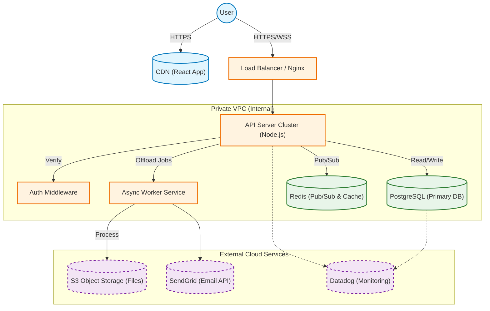
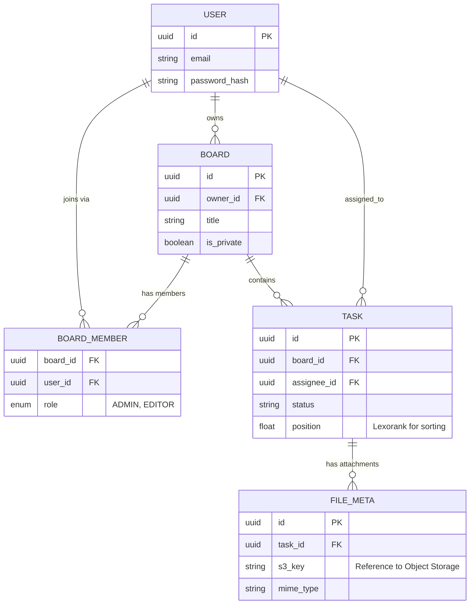

# SyncTask: Architecture Design Package

**Project:** SyncTask — Real-Time Collaborative Task Board  
**Version:** 1.0 (MVP to Phase I Roadmap)

## 1. Project Overview

### 1.1 Problem Summary

SyncTask addresses the friction in remote team collaboration where task status updates are often delayed or lost.

- **The Users:** Remote and hybrid agile teams, project managers, and developers who require instant visibility into project states.
- **The Problem:** Traditional HTTP-based task boards require manual refreshes to see changes made by colleagues, leading to "stale state" errors (e.g., two people working on the same task) and communication breakdowns.
- **The Solution:** A real-time collaborative Kanban board that synchronizes state instantly across all connected clients via WebSockets, ensuring a "single source of truth" without manual refreshing.

### 1.2 Core User Flows

The system is designed around four critical interaction patterns:

1. **User Login (Authentication):** Users exchange credentials for a secure, stateless JWT Session Token. This token is required for all subsequent HTTP and WebSocket connections.

2. **Create New Task (Transactional):** A standard RESTful flow where a user defines a task, the server authorizes the request, persists it to the SQL database, and returns the new resource ID.

3. **Real-Time Card Move (The "Sync" Flow):** The differentiator flow. When a user drags a card, the client sends a WebSocket frame. The server updates the database asynchronously and immediately broadcasts the change to all other connected clients on that board, bypassing the need for an HTTP refresh.

4. **Board Hydration (Hybrid Loading):** When joining a board, the client performs an initial HTTP GET to fetch the full board state ("hydration") while simultaneously establishing a WebSocket subscription for future updates.

### 1.3 Requirements

**Functional Requirements:**
- System must support secure user authentication (email/password).
- System must allow users to create, read, update, and delete (CRUD) tasks and boards.
- System must synchronize task position changes to all connected clients in under 200ms.
- System must support "Board Membership" roles (Admin vs. Editor).
- (Phase I) System must support file attachments for tasks.

**Non-Functional Requirements:**
- **Scalability:** Must support horizontal scaling of API servers using Redis for cross-server Pub/Sub communication.
- **Performance:** Initial board load must complete in under 500ms; real-time updates must feel instantaneous (Optimistic UI).
- **Availability:** Phase I architecture includes redundancy via Load Balancers and managed Database services to ensure 99.9% uptime.
- **Security:** All connections must be TLS/SSL; API access requires valid JWT; Passwords must be hashed (Bcrypt/Argon2).
- **Observability (Phase I):** System must alert engineers if Database CPU exceeds 80% utilization.

## 2. Architecture (High-Level + Component-Level)

### 2.1 High-Level Architecture Diagram

This diagram illustrates the Phase I architecture, which includes the necessary components for a stable public release (Caching, Workers, Object Storage).



### 2.2 Architectural Style Decision

**Decision:** Service-Based Architecture (Evolutionary)  
**Specifically:** A Monolithic Core API with Asynchronous Workers.

**Justification:**

- **Monolith vs. Microservices:** For the MVP/Phase I, we chose a Monolithic API Core rather than full microservices. Splitting "Tasks", "Boards", and "Users" into separate services at this stage would introduce unnecessary network latency and deployment complexity. The domain boundaries are tight, and transactions often span these entities (e.g., "User" joins "Board").

- **Worker Extraction:** We explicitly separated the Async Worker Service from the main API. Real-time applications cannot afford to block the Event Loop with heavy tasks like image processing or email sending. This separation allows the API to remain responsive to WebSocket events while heavy lifting happens in the background.

- **State Management:** The application state is Hybrid. The HTTP API is stateless (REST), but the Real-Time component is stateful (WebSockets). To resolve this conflict and allow horizontal scaling, we utilize Redis as a bridge, moving the "state" (who is connected where) out of the Node.js process memory and into a shared store.

### 2.3 Component Breakdown

- **Client (React + CDN):** A Single Page Application (SPA) responsible for optimistic UI updates and managing the WebSocket connection.

- **Load Balancer (Nginx):** Terminates SSL, handles WSS upgrade headers, and distributes traffic round-robin to API instances.

- **API Server (Node.js):** The primary logic center. Handles REST endpoints for CRUD and manages WebSocket rooms for real-time broadcasts.

- **Auth Middleware:** A logic module shared by all services to verify JWT signatures and extract user permissions before access is granted.

- **Redis (Pub/Sub):** The "glue" for scaling. Ensures that if User A is on Server 1 and User B is on Server 2, they still receive each other's updates.

- **Async Worker:** A separate process that consumes background jobs (e.g., sending "Welcome" emails, processing S3 file uploads).

- **PostgreSQL:** The authoritative system of record for all structured business data.

## 3. API Design Package

### 3.1 API Paradigm Decision

**Decision:** Hybrid (REST + WebSockets)

**Justification:**

- **Why REST?** For standard resource management (Creating Boards, Updating User Profiles, Fetching Lists), REST is robust, cacheable, and easy to document. Using WebSockets for everything (fetching initial data) is an anti-pattern that complicates error handling and caching.

- **Why WebSockets?** REST is "pull-based." For a collaborative board, users need "push-based" updates. Polling a REST endpoint every 1 second is inefficient and non-scalable. WebSockets allow the server to push updates (MOVE_CARD) instantly.

- **Why not GraphQL?** While GraphQL reduces over-fetching, the complexity of setting up GraphQL Subscriptions for the real-time aspect was deemed unnecessary overhead compared to raw WebSockets for this specific use case.

### 3.2 Representative Endpoints

#### 1. Authentication (REST)

**POST /api/auth/login**
- **Request:** `{ "email": "alice@example.com", "password": "..." }`
- **Response:** `200 OK` (Sets HTTP-Only Cookie: `access_token=jwt...`)

#### 2. Task Management (REST)

**GET /api/boards/:boardId/tasks**
- **Response:** `[ { "id": "101", "title": "Design DB", "status": "TODO", "position": 1.0 }, ... ]`

**POST /api/tasks**
- **Request:** `{ "boardId": "b-123", "title": "New Feature", "status": "TODO" }`
- **Response:** `201 Created { "id": "t-999", ... }`

#### 3. Real-Time Synchronization (WebSocket Events)

**Client → Server (Action):**
```json
{
  "type": "MOVE_CARD",
  "payload": {
    "taskId": "t-999",
    "newStatus": "DONE",
    "newPosition": 3.5
  }
}
```

**Server → Client (Broadcast):**
```json
{
  "type": "CARD_MOVED",
  "payload": {
    "taskId": "t-999",
    "movedBy": "u-456",
    "timestamp": 1620000000
  }
}
```

### 3.3 Authentication & Authorization

**Decision:** JWT (JSON Web Tokens) in HTTP-Only Cookies

**Justification:**

- **Statelessness:** JWTs are self-contained. The API server does not need to query the database to validate a token, only to verify its signature. This reduces DB load significantly.

- **Security:** Storing the JWT in an HTTP-Only cookie prevents XSS (Cross-Site Scripting) attacks from stealing the token via JavaScript.

- **Authorization Model:** Role-Based Access Control (RBAC) is implemented at the Board level. The BoardMember table defines if a user is an ADMIN (can delete board) or EDITOR (can only move tasks). This is checked by the Auth Middleware on every request.

## 4. Data Model & Storage

### 4.1 Database Choice & Justification

**Decision:** PostgreSQL (Primary) + Redis (Cache)

**Justification:**

- **Why PostgreSQL?** The data model is highly relational. Users belong to Boards, Boards contain Tasks, Tasks have Assignments. NoSQL solutions (like MongoDB) would require complex joins or data duplication to handle "All tasks for User A across all Boards." Postgres ensures ACID compliance, which is critical for maintaining data integrity (e.g., preventing a task from being "lost" if two users move it simultaneously).

- **Why Redis?** We need a store that is faster than disk for transient data (Session IDs, Socket IDs). Redis offers sub-millisecond access times required for real-time routing.

### 4.2 Data Schema



### 4.3 Data Access & Patterns

**Write Pattern (Lexorank):** To support efficient drag-and-drop reordering, we use floating-point positions (Lexorank). Instead of updating the index of every task when one moves (O(n)), we simply calculate the mid-point between the two surrounding tasks (O(1)).
- **Example:** Moving a card between position 100 and 200 gives it position 150.

**Read Pattern:** The system is Read-Heavy. GET /tasks happens frequently. We utilize database indexing on `board_id` to make this retrieval instantaneous.

**Caching Strategy:**
- **L1 Cache:** Redis stores active User Sessions.
- **L2 Cache:** (Phase II) Common queries (like "My Dashboard") will be cached in Redis with a 5-minute TTL to reduce DB load.

## 5. Implementation Team Proposals

### 5.1 MVP Structure (Agile / Vertical Slices)

For the initial build, we avoid separating "Frontend" and "Backend" teams to prevent communication silos on complex features like real-time sync.

**Total Headcount:** 6-8 Developers

**Team A: "Experience Squad" (3 Devs)**
- **Responsibility:** Standard web features (Login UI, HTTP CRUD, Drag-and-drop interactions).
- **Goal:** Deliver a polished, usable interface.

**Team B: "Sync Squad" (3 Devs)**
- **Responsibility:** The "Hard Engineering" (WebSocket Server, Database Design, Auth Security).
- **Goal:** Ensure data integrity and real-time connectivity.

### 5.2 Phase I Structure (Production / Horizontal Layers)

Once the MVP is live, we pivot to a structure that prioritizes reliability and infrastructure scaling.

**Total Headcount:** 8-10 Developers

**Team 1: "Product Stream" (5 Devs - formerly Experience Squad)**
- **Responsibility:** New feature development (File Attachments, User Profiles, UI Polish).
- **Focus:** Retention and User Experience.

**Team 2: "Platform Stream" (4 Devs - formerly Sync Squad)**
- **Responsibility:** Infrastructure stability (Redis scaling, S3 integration, Worker setup, Monitoring).
- **Focus:** Availability, Performance, and Security.

This structure allows the Product team to iterate fast on user feedback while the Platform team ensures the system doesn't crash under the new load.
