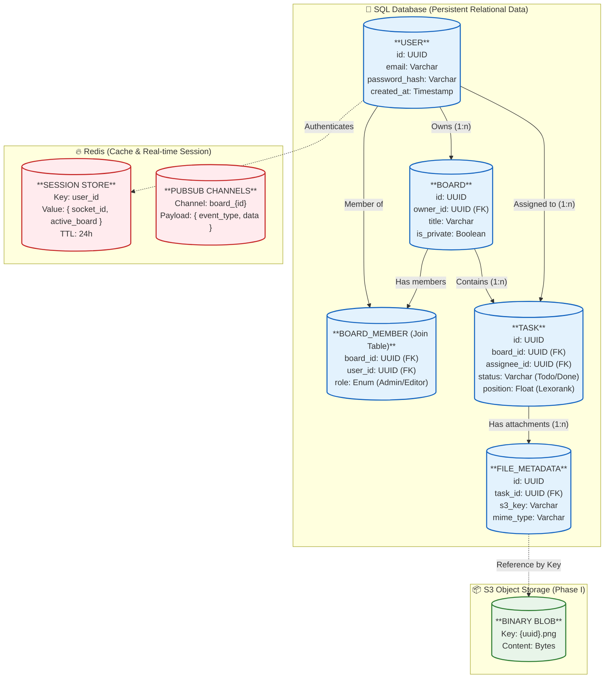

# Data Schema & Storage Design

This document outlines the data structure for SyncTask. It visualizes the entities, their relationships, and most importantly, where this data lives (Physical Boundaries) as we move from MVP to Phase I.

---

## 1. Simplified Schema Diagram with Boundaries

This diagram separates data by its physical storage location.

Arrows denote relationships (`||--o{` is 1-to-N).

Subgraphs denote the specific database/storage engine.

---

## 2. Entity Details & Implementation Notes

### A. The SQL Boundary (PostgreSQL)

Primary storage for all structured business data.

#### Users
- **Core Property:** `password_hash`. Never store plain text passwords.
- **Phase I Note:** We index `email` for fast login lookups (Flow 1).

#### Boards & BoardMembers
- **Relationship:** n-n (Many-to-Many).
- **Implementation:** We use a "Join Table" (`BoardMember`) rather than an array of IDs.
- **Why?** This allows us to store extra data like `role` (Admin vs Viewer) per user, per board.

#### Tasks
- **Core Property:** `position` (Float).
- **Why Float?** For Drag-and-Drop (Flow 3). If Task A is 1.0 and Task B is 2.0, putting Task C between them makes it 1.5. This avoids rewriting every single row in the DB when an item moves.

#### File_Metadata (Phase I)
- **Important:** The database does not store the image itself. It only stores the `s3_key` (the address) and the `mime_type`. This keeps the database lightweight and fast.

### B. The Redis Boundary (In-Memory)

Ephemeral storage for performance and real-time syncing.

#### Session Store
- **Data:** Maps a `user_id` to their current active WebSocket `socket_id`.
- **Usage:** When User A moves a card, the API looks up User B's `socket_id` here to send the push notification specifically to them (or broadcasts to the channel).

#### PubSub Channels
- **Concept:** Transient message buses. Data is not "stored" here long-term, but passes through.

### C. The S3 Boundary (Object Storage)

Heavy storage for binary files.

#### Binary Blob
- **Data:** The actual bytes of images/PDFs attached to tasks.
- **Access:** Accessed via a Signed URL generated by the API, keeping the bucket private.

---

## 3. Key Relationship Types

| Relationship | Entities | Description |
|--------------|----------|-------------|
| 1-to-N | Board -> Task | One board has many tasks. A task belongs to only one board. |
| N-to-N | User <-> Board | A user can join many boards; a board has many users. Managed via `BoardMember` table. |
| 1-to-1 | User -> Session | A user typically has one active WebSocket connection per device. |
| Reference | FileMeta -> S3 Blob | Logical link. The DB row "points" to the file in the cloud. |
