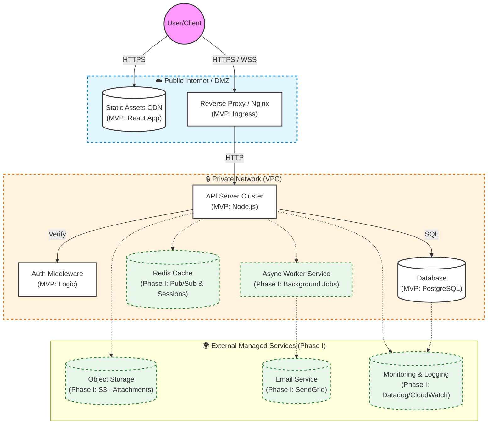

# Project Architecture: SyncTask (MVP & Phase I)

## 1. Project Overview

SyncTask is a real-time collaborative task board. This document outlines the architectural evolution from the Minimum Viable Product (MVP) to a production-ready Phase I release, followed by a strategy for future scaling (Phase II).

---

## 2. Architecture Diagram (MVP + Phase I)

This diagram visualizes the system:
- **Solid Lines/Shapes:** Represent the core MVP components
- **Dashed Lines / Green Shapes:** Represent Phase I additions required for a stable public release

---

## 3. Phase I: Production Readiness (Release Strategy)

While the MVP demonstrates functionality, Phase I introduces the reliability and management layers necessary for a public launch. We cannot release to real users without these safeguards.

### New Components & Justification

| Component | Type | Why it is needed for Release (Phase I) |
|-----------|------|----------------------------------------|
| **Redis** | Caching / PubSub | **Scalability:** In the MVP, WebSockets only work on one server. To support multiple servers for reliability, Redis is required to "bridge" messages between users connected to different server instances. |
| **Object Storage** | S3 / Blob | **Performance:** Storing user-uploaded images/attachments in the database is an anti-pattern. S3 provides cheap, scalable storage without bloating the DB. |
| **Email Service** | External API | **Account Recovery:** Real users forget passwords. Without an email service (like SendGrid), we cannot offer "Forgot Password" functionality, resulting in permanent user lockouts. |
| **Monitoring** | Observability | **Reliability:** We need automated alerts (e.g., Datadog or CloudWatch) to know if the server crashes before users complain. |

---

## 4. Phase II: Scaling & Optimization (Future)

Phase II focuses on handling growth and improving user experience based on usage patterns.

### Proposed Changes & Triggers

| Feature | Change Required | Implementation Order & Trigger Signal |
|---------|-----------------|---------------------------------------|
| **Advanced Search** | Add Elasticsearch or Algolia | **Trigger:** When simple SQL LIKE queries take >200ms or task volume exceeds 10,000 per board. |
| **Push Notifications** | Add Firebase (FCM) and Service Workers | **Trigger:** User feedback requesting updates while away from the desk ("I missed a task assignment"). |
| **Data Analytics** | Add Data Warehouse (Snowflake) pipeline | **Trigger:** Marketing/Product teams need complex reports on "User Retention" that slow down the production DB. |

### Decision Logic: How we decide what comes next

We prioritize Phase II features based on **Technical Debt vs. User Signals:**

- **High Priority (Technical Bottlenecks):** If the Database CPU hits 80% utilization consistently, Search Offloading becomes the immediate priority to prevent outages.
- **Medium Priority (User Signals):** If users complain about missing updates, Push Notifications are prioritized to improve retention.
- **Low Priority (Nice-to-haves):** Features like "AI Task Summaries" are deferred until core stability and retention metrics are met.

---

## 5. Legend

| Symbol / Style | Meaning |
|----------------|---------|
| **Solid White Box** | MVP Component: Essential for the app to function. |
| **Dashed Green Box** | Phase I Component: Essential for reliability/production. |
| **Solid Line** | Synchronous Traffic: HTTP Request/Response. |
| **Dashed Line** | Asynchronous/Back-channel: Logs, background jobs, cache. |
| **Blue Area** | Public Zone: Exposed to the internet. |
| **Orange Area** | Private Zone: Protected internal network. |
