# Project Architecture: SyncTask (MVP)

## 1. Project Overview

SyncTask is a real-time collaborative task board (similar to a simplified Trello). This document outlines the Minimum Viable Product (MVP) architecture, focusing on the separation of concerns, security, and real-time data synchronization.

## 2. Architecture Diagram

```mermaid
graph TD
    %% Define Styles
    classDef actor fill:#f9f,stroke:#333,stroke-width:2px;
    classDef public fill:#e1f5fe,stroke:#0277bd,stroke-width:2px,stroke-dasharray: 5 5;
    classDef private fill:#fff3e0,stroke:#ef6c00,stroke-width:2px,stroke-dasharray: 5 5;
    classDef component fill:#fff,stroke:#333,stroke-width:1px;

    %% Actors
    User((User/Client)):::actor

    %% Public Zone (DMZ)
    subgraph Public_Internet ["☁️ Public Internet / DMZ"]
        direction TB
        CDN[("Static Assets CDN<br/>(React App)")]:::component
        LoadBalancer["Reverse Proxy / Load Balancer<br/>(Nginx)"]:::component
    end

    %% Private Zone (Internal Network)
    subgraph Private_Network ["🔒 Private Network (VPC)"]
        direction TB
        APIServer["API Server Cluster<br/>(Node.js/Express)"]:::component
        AuthService["Auth Middleware"]:::component
        DB[("Database<br/>(PostgreSQL)")]:::component
    end

    %% Connections
    User -- "HTTPS (Port 443)<br/>[Auth: None for assets]" --> CDN
    User -- "HTTPS / WSS (Secure WebSocket)<br/>[Auth: Bearer Token]" --> LoadBalancer
    
    LoadBalancer -- "HTTP (Port 80)<br/>Internal Traffic" --> APIServer
    
    APIServer -- "Check/Verify JWT" --> AuthService
    APIServer -- "TCP (Port 5432)" --> DB

    %% Apply Subgraph Styles
    class Public_Internet public
    class Private_Network private
```

> **Note:** If the diagram above displays as code on GitHub, it means the native Mermaid viewer might be disabled in your specific view. However, it is valid syntax.

## 3. MVP Component Breakdown

To maintain MVP scope, only essential components are included:

- **Frontend (SPA):** A React-based Single Page Application.
- **Load Balancer/Proxy:** Nginx to handle SSL termination and route traffic.
- **Backend API:** Node.js/Express server to handle business logic.
- **Database:** PostgreSQL for persistent relational data storage.

## 4. Users & Interface Strategy

### The User
Interacts with the system via a standard web browser.

### The Interface
1. The user requests the application URL.
2. The CDN delivers the static HTML/CSS/JS bundle immediately.
3. Once loaded, the browser acts as a "thick client," performing API calls to the backend to fetch dynamic data (tasks, columns, user profile).

## 5. Communication & Authentication

### Communication Strategies

- **HTTPS (REST):** Used for standard transactional operations (e.g., Creating a card, editing a profile). Encryption ensures data privacy in transit.
- **WSS (Secure WebSockets):** Used for real-time collaboration. When User A moves a card, a WebSocket event is broadcast to the API, which pushes the update to User B instantly.
- **TCP:** Used strictly for internal server-to-database communication.

### Authentication Strategy

**Method:** JSON Web Tokens (JWT).

**Flow:**
1. User logs in via HTTPS.
2. Server verifies credentials and issues a signed JWT.
3. Client stores JWT (HttpOnly Cookie or Memory).
4. Client attaches the JWT as a Bearer Token in the Authorization header for all subsequent API and WebSocket requests.

## 6. Network Segmentation (Public vs. Private)

To ensure security, the infrastructure is divided into two zones:

### 🟢 Directly Available (Public Internet)

- **CDN:** Hosts the static frontend files.
- **Load Balancer (Nginx):** The single entry point for API traffic. It exposes port 443 (HTTPS) to the world.

### 🔴 Internal Only (Private Network/VPC)

- **API Server:** Does not have a public IP. It accepts traffic only from the Load Balancer.
- **Database:** Deepest layer of security. Accepts connections only from the API Server on port 5432. No public internet access.

## 7. Legend

| Symbol / Style | Meaning |
|----------------|---------|
| Solid Line | Synchronous Request (Request/Response) |
| Blue Dashed Box | Public Zone: Accessible by anyone on the internet |
| Orange Dashed Box | Private Zone: Accessible only by internal systems |
| Cylinder | Data Storage |
| WSS | WebSocket Secure (Real-time connection) |
