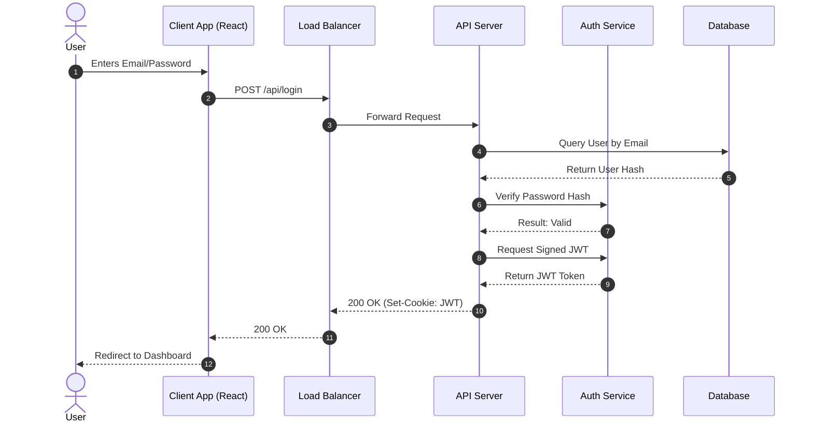
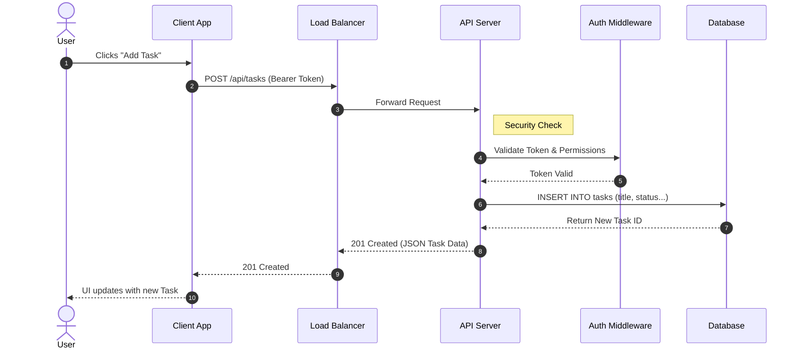
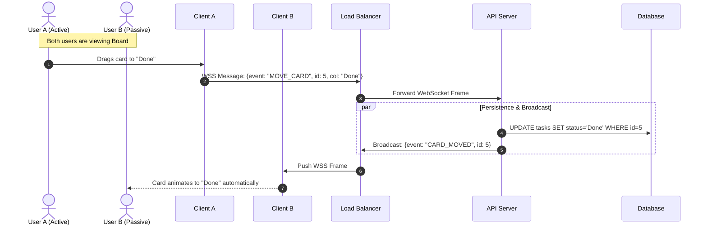
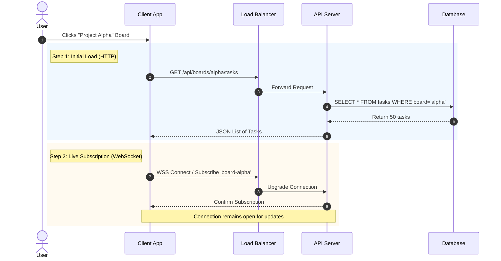

# Core User Flows & Sequence Diagrams

This document outlines 4 critical user flows for the SyncTask system, mapped to the project architecture.

---

## Flow 1: User Login (Authentication)

**Description:** The user exchanges credentials for a secure Session Token (JWT). This flow is critical as it involves the Auth Middleware verifying data against the Database before issuing access.

---

## Flow 2: Creating a New Task

**Description:** A standard transactional flow. The user creates data that must be persisted permanently. Note the Auth Check that happens before the DB write.

---

## Flow 3: Real-Time Card Move (The "Sync" Flow)

**Description:** This is the most unique flow. It uses WebSockets (WSS) instead of HTTP. When User A moves a card, the server pushes that update to User B instantly, bypassing the need for User B to refresh.

---

## Flow 4: Joining a Board (Hydration & Subscription)

**Description:** When a user opens a board, two things happen: they fetch the initial state (HTTP) and subscribe to future updates (WSS).

---

## Summary

These four flows demonstrate the core interactions in the SyncTask system:

1. **Authentication** - Secure user verification and session management
2. **Task Creation** - Standard CRUD operation with authorization
3. **Real-Time Sync** - WebSocket-based live collaboration
4. **Board Hydration** - Hybrid HTTP/WebSocket pattern for optimal UX
